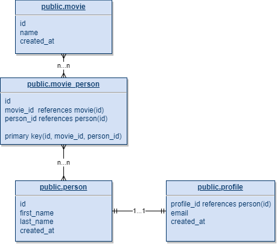

<p align="center">

</p>

<p align="center">
  
<a href="https://www.nuget.org/packages/postgrest-csharp/">
  
</a>
</p>

---

## Now supporting (many) LINQ expressions!

```c#
await client.Table<Movie>()
            .Select(x => new object[] { x.Id, x.Name, x.Tags, x.ReleaseDate })
            .Where(x => x.Tags.Contains("Action") || x.Tags.Contains("Adventure"))
            .Order(x => x.ReleaseDate, Ordering.Descending)
            .Get();

await client.Table<Movie>()
            .Set(x => x.WatchedAt, DateTime.Now)
            .Where(x => x.Id == "11111-22222-33333-44444")
            // Or .Filter(x => x.Id, Operator.Equals, "11111-22222-33333-44444")
            .Update();

```

---

Documentation can be found [here](https://supabase-community.github.io/postgrest-csharp/api/Postgrest.html).

Postgrest-csharp is written primarily as a helper library for [supabase/supabase-csharp](https://github.com/supabase/supabase-csharp), however, it should be easy enough to use outside of the supabase ecosystem.

The bulk of this library is a translation and c-sharp-ification of the [supabase/postgrest-js](https://github.com/supabase/postgrest-js) library.

## Getting Started

Postgrest-csharp is _heavily_ dependent on Models deriving from `BaseModel`. To interact with the API, one must have the associated
model specified.

To use this library on the Supabase Hosted service but separately from the `supabase-csharp`, you'll need to specify your url and public key like so:
```c#
var auth = new Supabase.Gotrue.Client(new ClientOptions<Session>
{
    Url = "https://PROJECT_ID.supabase.co/auth/v1",
    Headers = new Dictionary<string, string>
    {
        { "apikey", SUPABASE_PUBLIC_KEY },
        { "Authorization", $"Bearer {SUPABASE_USER_TOKEN}" }
    }
})
```

Leverage `Table`,`PrimaryKey`, and `Column` attributes to specify names of classes/properties that are different from their C# Versions.

```c#
[Table("messages")]
public class Message : BaseModel
{
    [PrimaryKey("id")]
    public int Id { get; set; }

    [Column("username")]
    public string UserName { get; set; }

    [Column("channel_id")]
    public int ChannelId { get; set; }

    public override bool Equals(object obj)
    {
        return obj is Message message &&
                Id == message.Id;
    }

    public override int GetHashCode()
    {
        return HashCode.Combine(Id);
    }
}
```

Utitilizing the client is then just a matter of instantiating it and specifying the Model one is working with.

```c#
void Initialize()
{
    var client = new Client("http://localhost:3000");

    // Get All Messages
    var response = await client.Table<Message>().Get();
    List<Message> models = response.Models;

    // Insert
    var newMessage = new Message { UserName = "acupofjose", ChannelId = 1 };
    await client.Table<Message>().Insert();

    // Update
    var model = response.Models.First();
    model.UserName = "elrhomariyounes";
    await model.Update();

    // Delete
    await response.Models.Last().Delete();
}
```

## Foreign Keys, Join Tables, and Relationships

The Postgrest server does introspection on relationships between tables and supports returning query data from
tables with these included. **Foreign key constrains are required for postgrest to detect these relationships.**

This library implements the attribute, `Reference` to specify on a model when a relationship should be included in a query.

- [One-to-one Relationships](https://postgrest.org/en/stable/api.html#one-to-one-relationships): One-to-one relationships are detected if there’s an unique constraint on a foreign key.
- [One-to-many Relationships](https://postgrest.org/en/stable/api.html#one-to-many-relationships): The inverse one-to-many relationship between two tables is detected based on the foreign key reference.
- [Many-to-many Relationships](https://postgrest.org/en/stable/api.html#many-to-many-relationships): Many-to-many relationships are detected based on the join table. The join table must contain foreign keys to other two tables and they must be part of its composite key.

Given the following schema:



We can define the following models:

```c#
[Table("movie")]
public class Movie : BaseModel
{
    [PrimaryKey("id", false)]
    public int Id { get; set; }

    [Column("name")]
    public string Name { get; set; }

    [Reference(typeof(Person))]
    public List<Person> Persons { get; set; }


    [Column("created_at")]
    public DateTime CreatedAt { get; set; }
}

[Table("person")]
public class Person : BaseModel
{
    [PrimaryKey("id",false)]
    public int Id { get; set; }

    [Column("first_name")]
    public string FirstName { get; set; }

    [Column("last_name")]
    public string LastName { get; set; }

    [Reference(typeof(Profile))]
    public Profile Profile { get; set; }

    [Column("created_at")]
    public DateTime CreatedAt { get; set; }
}

[Table("profile")]
public class Profile : BaseModel
{
    [Column("email")]
    public string Email { get; set; }
}
```

**Note that each related model should inherit `BaseModel` and specify its `Table` and `Column` attributes as usual.**

The `Reference` Attribute by default will include the referenced model in all queries on the table (this can be disabled in its constructor).

As such, a query on the `Movie` model (given the above) would return something like:
```js
[
    {
        id: 1,
        created_at: "2022-08-20T00:29:45.400188",
        name: "Top Gun: Maverick",
        person: [
            {
            id: 1,
            created_at: "2022-08-20T00:30:02.120528",
            first_name: "Tom",
            last_name: "Cruise",
            profile: {
                profile_id: 1,
                email: "tom.cruise@supabase.io",
                created_at: "2022-08-20T00:30:33.72443"
                }
            },
            {
                id: 3,
                created_at: "2022-08-20T00:30:33.72443",
                first_name: "Bob",
                last_name: "Saggett",
                profile: {
                    profile_id: 3,
                    email: "bob.saggett@supabase.io",
                    created_at: "2022-08-20T00:30:33.72443"
                }
            }
        ]
    },
    // ...
]
```

**Further Notes**:
- Postgrest does not support nested inserts or upserts. Relational keys on models will be ignored when attempting to insert or upsert on a root model.
- The `Relation` attribute uses reflection to only select the attributes specified on the Class Model (i.e. the `Profile` model has a property only for `email`, only the property will be requested in the query).


## Status

- [x] Connects to PostgREST Server
- [x] Authentication
- [x] Basic Query Features
  - [x] CRUD
  - [x] Single
  - [x] Range (to & from)
  - [x] Limit
  - [x] Limit w/ Foreign Key
  - [x] Offset
  - [x] Offset w/ Foreign Key
- [x] Advanced Query Features
  - [x] Filters
  - [x] Ordering
- [ ] Custom Serializers
  - [ ] [Postgres Range](https://www.postgresql.org/docs/9.3/rangetypes.html)
    - [x] `int4range`, `int8range`
    - [ ] `numrange`
    - [ ] `tsrange`, `tstzrange`, `daterange`
- [x] Models
  - [x] `BaseModel` to derive from
  - [x] Coercion of data into Models
- [x] Unit Testing
- [x] Nuget Package and Release

## Package made possible through the efforts of:

|  |  |
| :--------------------------------------------------------------------: | :-------------------------------------------------------------------------: |
|              [acupofjose](https://github.com/acupofjose)               |            [elrhomariyounes](https://github.com/elrhomariyounes)            |

## Contributing

We are more than happy to have contributions! Please submit a PR.
